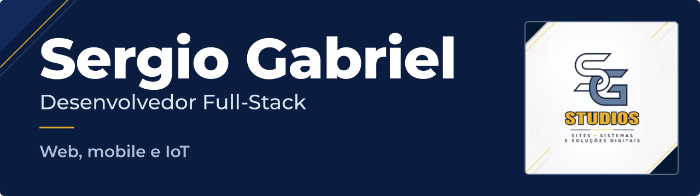

Desenvolvo aplicações web, aplicativos mobile, sistemas administrativos e soluções IoT para necessidades reais, sob a marca **SG Studios**.

**[Portfólio](https://www.sergiogabrieltf.com.br/)** · **[PTMB](https://tenisdemesa.sergiogabrieltf.com.br/)** · **[LinkedIn](https://www.linkedin.com/in/sergio-gabriel-tavares-farias-624775268/)**

## Sobre mim

Sou Sergio Gabriel Tavares Farias, desenvolvedor Full-Stack em Belém, no Pará, e estudo Engenharia de Computação no CESUPA desde janeiro de 2023. Meu trabalho parte de necessidades reais: entendo a regra de negócio, desenho interfaces que as pessoas consigam usar e cuido das integrações, dos dados e da organização técnica de cada projeto.

Hoje meu foco está em desenvolvimento web, mobile e IoT. Minha experiência institucional inclui um estágio no Instituto Gustavo Hessel (IGH), com desenvolvimento de soluções para processos internos.

## O que desenvolvo

- **Aplicações web e plataformas SaaS:** interfaces, autenticação, regras de negócio e persistência de dados, com Next.js e TypeScript.
- **Aplicativos mobile:** apps com React Native e Expo, integrados a APIs e a serviços de autenticação e persistência.
- **Sistemas administrativos:** cadastros, permissões de acesso e rastreabilidade para organizar processos do dia a dia.
- **Integrações e IoT:** pagamentos com Mercado Pago e soluções que conectam sensores a aplicações, com ESP32, células de carga e HX711.

## Projetos em destaque

Cada descrição resume o escopo do projeto. Links aparecem apenas onde há endereço público.

### PTMB: Plataforma Tênis de Mesa do Brasil

Plataforma voltada a atletas, clubes e organizadores. O escopo envolve organização de torneios, inscrições, categorias de simples e duplas, rankings, gestão de clubes e pagamentos.

`Next.js` `TypeScript` `Firebase` `Mercado Pago` 
Site público: [tenisdemesa.sergiogabrieltf.com.br](https://tenisdemesa.sergiogabrieltf.com.br/)

### PTMB Mobile

Aplicativo voltado aos atletas, integrado ao ecossistema da plataforma web. Está em desenvolvimento.

`React Native` `Expo` `TypeScript`

### AquaPantoja: sistema de piscicultura

Sistema administrativo para gestão da produção aquícola, com interface pensada para facilitar o uso por pessoas sem formação técnica. O escopo envolve propriedades, viveiros, lotes, alimentação, biometria, indicadores produtivos e qualidade da água.

`Next.js` `TypeScript` `Tailwind CSS` `Supabase`

### Sistemas administrativos do IGH

- **Sistema CRC:** organização de processos internos, com controle de acesso e permissões por unidade. O escopo envolve unidades, colaboradores, doações, lotes, volumes, equipamentos e rastreabilidade.
- **Gerador de certificados:** ferramenta para geração e organização de certificados em PDF. O escopo envolve modelos editáveis, dados de alunos e cursos, assinaturas, frente e verso, geração em lote e histórico.

`Next.js` `TypeScript` `Firebase` `PDF`

### Balança inteligente e soluções IoT

Soluções que conectam sensores a aplicações, integrando hardware, aquisição de dados e software.

`ESP32` `HX711` `Células de carga`

## Stack

Em negrito, as tecnologias que aparecem nos projetos em destaque.

**Web e interfaces** 
**`Next.js`** **`TypeScript`** **`Tailwind CSS`** `React` `JavaScript` `HTML` `CSS`

**Mobile** 
**`React Native`** **`Expo`** `Expo Router`

**Backend e integrações** 
`Node.js` `Java` `Spring Boot` `Spring MVC` `APIs REST` `Autenticação e autorização` **`Mercado Pago`**

**Dados e serviços** 
**`Firebase`** `Firebase Authentication` `Cloud Firestore` `Firebase Storage` **`Supabase`** `PostgreSQL` `Turso` `SQL`

**Infraestrutura e ferramentas** 
`Git` `GitHub` `Vercel` `Google Cloud Console` `Visual Studio Code` `Visual Studio` `Linux Mint` `Windows`

**IoT e embarcados** 
**`ESP32`** **`HX711`** **`Células de carga`** `Sensores` `C` `C++` `Arduino` `PlatformIO` `Raspberry Pi`

Conhecimentos complementares

 

`C#` `Bootstrap`

Também uso assistentes de programação, como Claude Code, Codex e modelos locais com Ollama, como apoio ao desenvolvimento.

## Como trabalho

São as prioridades que orientam minhas decisões técnicas em cada projeto:

- **Organização modular:** código separado por responsabilidade, para facilitar a manutenção e a evolução.
- **Regras de negócio claras:** fluxos, permissões e restrições descritos de forma explícita, antes e durante a implementação.
- **Atenção à usabilidade:** interfaces simples, pensadas para quem usa o sistema no dia a dia, inclusive sem formação técnica.
- **Controle de acesso e proteção de dados:** autenticação, autorização e cuidado com o que cada perfil pode ver e alterar.
- **Integrações consistentes:** comunicação previsível entre APIs, serviços de pagamento e dispositivos.
- **Validação e documentação:** validação de dados e regras, e documentação para que outras pessoas consigam entender e manter o projeto.

## Além do código

Jogo tênis de mesa como atleta do Paysandu, e o esporte também está presente nos meus projetos, como a PTMB. Minha base é Belém do Pará.

## Contato

- **Portfólio:** [sergiogabrieltf.com.br](https://www.sergiogabrieltf.com.br/)
- **LinkedIn:** [Sergio Gabriel Tavares Farias](https://www.linkedin.com/in/sergio-gabriel-tavares-farias-624775268/)
- **E-mail:** [sergiogabrieltf@gmail.com](mailto:sergiogabrieltf@gmail.com)

